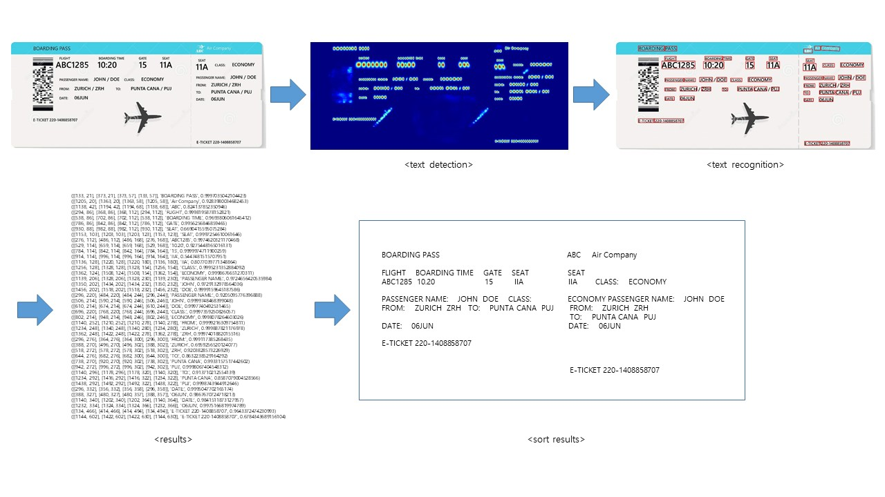
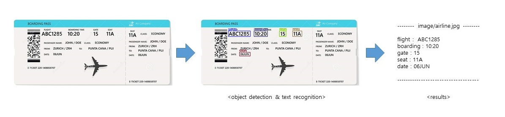

# Easy Yolo OCR


[](https://www.linkedin.com/in/inpyo-hong-886781212/)

[[Korean README]](https://github.com/aqntks/Easy-Yolo-OCR/blob/master/README.md)

Proceed with text detection only in the selected area

This repository is a project using [yolov5](https://github.com/ultralytics/yolov5) and [EasyOCR](https://github.com/JaidedAI/EasyOCR).

## Introduction

The existing OCR (Optical Character Recognition) process detects a character area with the Text Detection model and then recognizes the character through the Text Recognition model. These OCR models are effective in recognizing the entire character within a desired document or image.    

However, if you want to detect only the characters in a specific area within an image or document, it detects unnecessary areas too, so the detection speed takes a long time and it is inconvenient to process the result value.

We suggest Easy Yolo OCR for those who want to detect only characters located in a specific pattern or area in various images.

Easy Yolo OCR has changed the Text Detection model for detecting text areas to the Object Detection model used for object detection. Learn a custom detection model that suits you and detect only the desired area of ​​the desired format.

The object detection model uses [yolov5](https://github.com/ultralytics/yolov5), which is actively used in the real-time object detection field. The OCR process benchmarked [EasyOCR](https://github.com/JaidedAI/EasyOCR) and the Text Recognition model was trained through [deep-text-recognition-benchmark](https://github.com/clovaai/deep-text-recognition-benchmark) of Clova AI Research.

- Existing OCR process



- Easy Yolo OCR process




## Installation


``` bash
$ git clone https://github.com/aqntks/Easy-Yolo-OCR
$ cd Easy-Yolo-OCR
$ pip install -r requirements.txt
```

## OCR

```bash
$ python main.py --gpu 0 --lang en/ko
$ python main.py --gpu 0 --lang en
$ python main.py --gpu -1 --lang ko         # --gpu -1 : cpu mode
```

## Prepare Training Data
``` bash
$ cd yolov5
```
### 1. Data location
Place the image file(jpg, png ... etc) and labeling file(txt) in the "yolov5/dataset/custom_data" folder.

---yolov5/dataset\
&nbsp;&nbsp;&nbsp;&nbsp;&nbsp;&nbsp;&nbsp;&nbsp;&nbsp;&nbsp;ㄴ---custom_data\
&nbsp;&nbsp;&nbsp;&nbsp;&nbsp;&nbsp;&nbsp;&nbsp;&nbsp;&nbsp;&nbsp;&nbsp;&nbsp;&nbsp;&nbsp;&nbsp;&nbsp;&nbsp;&nbsp;&nbsp;&nbsp;ㄴ---image1.jpg\
&nbsp;&nbsp;&nbsp;&nbsp;&nbsp;&nbsp;&nbsp;&nbsp;&nbsp;&nbsp;&nbsp;&nbsp;&nbsp;&nbsp;&nbsp;&nbsp;&nbsp;&nbsp;&nbsp;&nbsp;&nbsp;&nbsp;&nbsp;&nbsp;&nbsp;---image1.txt\
&nbsp;&nbsp;&nbsp;&nbsp;&nbsp;&nbsp;&nbsp;&nbsp;&nbsp;&nbsp;&nbsp;&nbsp;&nbsp;&nbsp;&nbsp;&nbsp;&nbsp;&nbsp;&nbsp;&nbsp;&nbsp;&nbsp;&nbsp;&nbsp;&nbsp;---image2.jpg\
&nbsp;&nbsp;&nbsp;&nbsp;&nbsp;&nbsp;&nbsp;&nbsp;&nbsp;&nbsp;&nbsp;&nbsp;&nbsp;&nbsp;&nbsp;&nbsp;&nbsp;&nbsp;&nbsp;&nbsp;&nbsp;&nbsp;&nbsp;&nbsp;&nbsp;---image2.txt\
&nbsp;&nbsp;&nbsp;&nbsp;&nbsp;&nbsp;&nbsp;&nbsp;&nbsp;&nbsp;&nbsp;&nbsp;&nbsp;&nbsp;&nbsp;&nbsp;&nbsp;&nbsp;&nbsp;&nbsp;&nbsp;&nbsp;&nbsp;&nbsp;&nbsp;---image3.jpg\
&nbsp;&nbsp;&nbsp;&nbsp;&nbsp;&nbsp;&nbsp;&nbsp;&nbsp;&nbsp;&nbsp;&nbsp;&nbsp;&nbsp;&nbsp;&nbsp;&nbsp;&nbsp;&nbsp;&nbsp;&nbsp;&nbsp;&nbsp;&nbsp;&nbsp;---image3.txt

### 2. Configure labeling text(image.txt)
(ClassIndex)&nbsp;&nbsp;(BoxCenterX[value 0-1])&nbsp;&nbsp;(BoxCenterY[value 0-1])&nbsp;&nbsp;(BoxWidth[value 0-1])&nbsp;&nbsp;(BoxHeight[value 0-1])\
(ClassIndex)&nbsp;&nbsp;(BoxCenterX[value 0-1])&nbsp;&nbsp;(BoxCenterY[value 0-1])&nbsp;&nbsp;(BoxWidth[value 0-1])&nbsp;&nbsp;(BoxHeight[value 0-1])\
(ClassIndex)&nbsp;&nbsp;(BoxCenterX[value 0-1])&nbsp;&nbsp;(BoxCenterY[value 0-1])&nbsp;&nbsp;(BoxWidth[value 0-1])&nbsp;&nbsp;(BoxHeight[value 0-1])\
                         
```bash
# ex) image1.txt 

0 0.6659722222222223 0.11302083333333333 0.4013888888888889 0.06770833333333333
9 0.48333333333333334 0.12552083333333333 0.025 0.036458333333333336
3 0.5145833333333334 0.1265625 0.02638888888888889 0.036458333333333336
1 0.5479166666666667 0.125 0.0375 0.0375
4 0.5798611111111112 0.125 0.029166666666666667 0.03333333333333333
8 0.6145833333333334 0.12447916666666667 0.03194444444444445 0.03854166666666667
4 0.6479166666666667 0.12395833333333334 0.03194444444444445 0.041666666666666664
2 0.68125 0.12447916666666667 0.03194444444444445 0.03229166666666666
3 0.7145833333333333 0.12395833333333334 0.03194444444444445 0.03125
7 0.7465277777777778 0.12552083333333333 0.029166666666666667 0.034375
0 0.78125 0.12239583333333333 0.03194444444444445 0.03229166666666666
8 0.8104166666666667 0.125 0.029166666666666667 0.0375
0 0.8423611111111111 0.12343749999999999 0.034722222222222224 0.036458333333333336
```

### 3. Create train, valid, test file
yolov5/dataset/custom_train.txt\
yolov5/dataset/custom_valid.txt\
yolov5/dataset/custom_train_test.txt (optional)

```bash
# ex) custom_train.txt

dataset/custom_data/image001.jpg
dataset/custom_data/image002.jpg
dataset/custom_data/image003.jpg
dataset/custom_data/image004.jpg
              .
              .
              .
```
```bash
# ex) custom_valid.txt

dataset/custom_data/image101.jpg
dataset/custom_data/image102.jpg
dataset/custom_data/image103.jpg
dataset/custom_data/image104.jpg
              .
              .
              .
```
```bash
# ex) custom_test.txt (optional)

dataset/custom_data/image151.jpg
dataset/custom_data/image152.jpg
dataset/custom_data/image153.jpg
dataset/custom_data/image154.jpg
              .
              .
              .
```

### 4. Write custom.yaml
Create the data/custom.yaml file and write the following

```bash
# custom.yaml

path: ./dataset
train: custom_train.txt
val:  custom_valid.txt
test:  custom_train_test.txt  # (optional)

nc: 10  # number of classes
names: ['title', 'name', 'personal_id', 'text_box_1', 'text_box_2', 'price', 'address', 'age', 'date', 'count']  # class names
```

## Train Detection Model

```bash
$ python train.py --data data/custom.yaml --weights yolov5s.pt --img 640 --batch-size 64 --epochs 300
                                                    yolov5m.pt       960              40          100
                                                    yolov5l.pt       480              24           50 
                                                    yolov5x.pt       320              16           30 
```

## Setting Config
```bash
# config.yaml

images: image                                # detection image folder

detection: weights/example.pt                # trained detecting model
detection-size: 640                          # Detection image size
detection-confidence: 0.25                   # detecting confidence
detection-iou: 0.45                          # detecting iou
```


